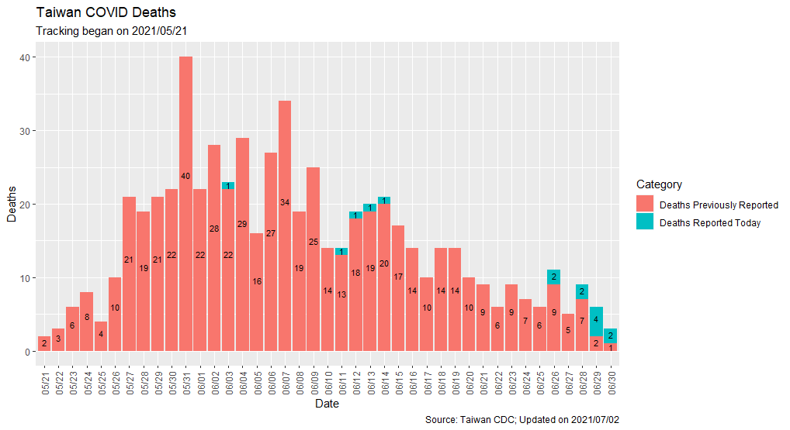
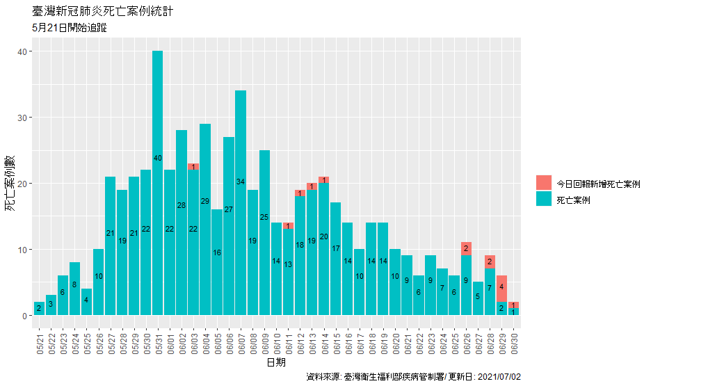

## Overview
This is a repository for tracking COVID deaths in the recent outbreak in Taiwan.
The data is pulled from a daily release issued by the [Taiwan Centers for Disease Control](https://www.cdc.gov.tw/) (Taiwan-CDC), which typically goes live at 2PM 
Taiwan Time (GMT +8). 

Many of the deaths reported in the daily release are records from previous days; 
sometimes they can lag up to a month, although that seems to be improving. The 
purpose of this project is to tally up the deaths by its reporting date instead
of the date of the news release. Additionally, other statistics, such as the age,
gender, and chronic condition splits of the deaths are also summarized and presented. 

The Shiny app is nearly complete; estimated time of release is July 4th, 2021. 

Note that since I did not start collecting data from Taiwan CDC until late May, 
and there were no similar news releases that contained data prior to May 21st,
this project under reports 59 deaths that occurred before this date. 

Additionally, 1 more death is not counted for July 2, where a death was recorded
on the official release but the cause of death was ruled to be unrelated to COVID. 
Please see the July 2nd pdf for more information. This brings the total difference
between this project and Taiwan's official death counts to 60. 

Special thanks to [@xyk2](https://github.com/xyk2) for the idea to snap true 
dates of death from the daily news releases. 

## Roadmap 

Plots for newly reported deaths and other statistics can be found in the [**plots**](https://github.com/greghuang8/Taiwan_Covid_Dash/tree/main/plots) folder. 

A summarized csv file that groups each day's death statistics can be found at 
[**Full_statistics.csv**](https://github.com/greghuang8/Taiwan_Covid_Dash/blob/main/Full_statistics.csv).

Each day's new added deaths are stored in the [**daily_changes**](https://github.com/greghuang8/Taiwan_Covid_Dash/tree/main/daily_changes) folder. 

## Example outputs

Here are example plots (from July 2, with 14 deaths reported), indicating newly added deaths reported today, in English:

and in Traditional Chinese:
  

