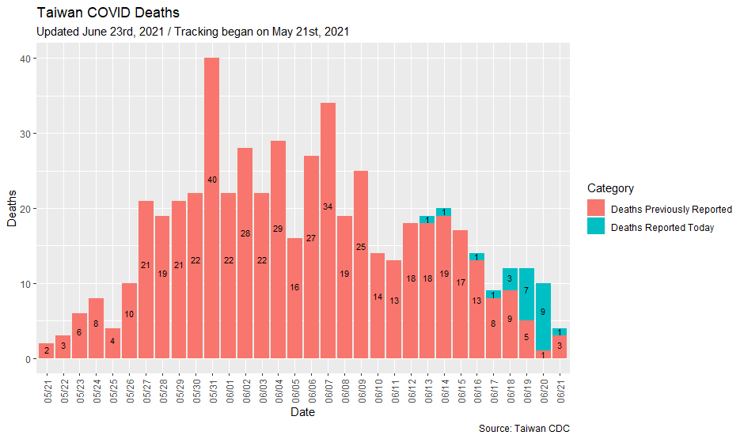
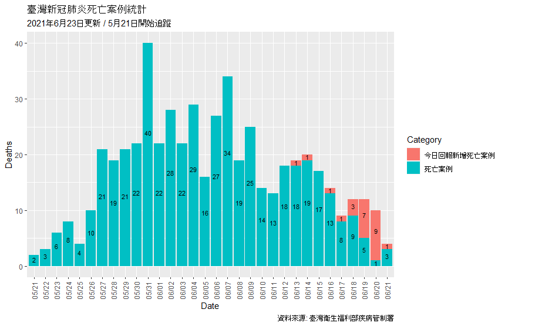
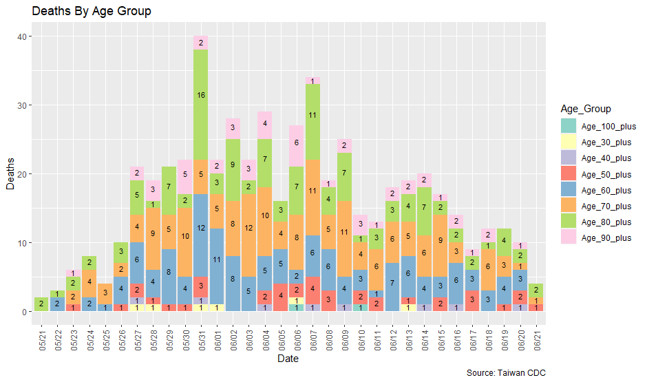
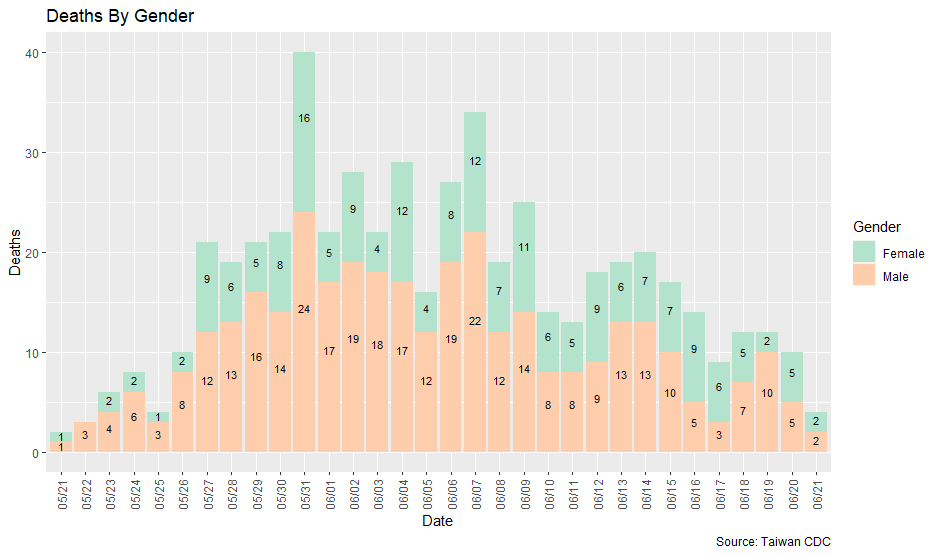
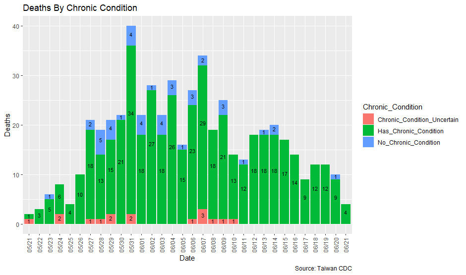
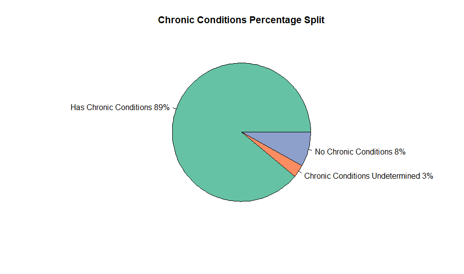
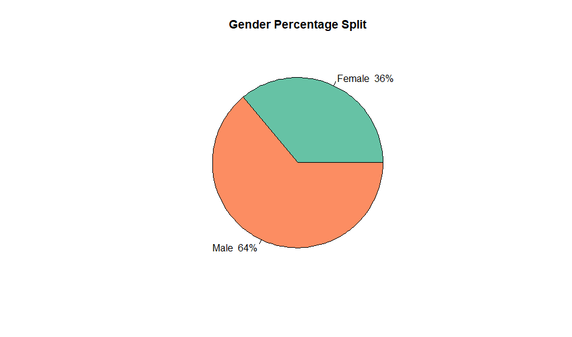

# Taiwan_Covid_Dash

## Overview
This is a repository for tracking COVID deaths in the recent outbreak in Taiwan.
The data is pulled from a daily release issued by the [Taiwan Centers for Disease Control](https://www.cdc.gov.tw/) (Taiwan-CDC), which typically goes live at 2PM 
Taiwan Time (GMT +8). 

Many of the deaths reported in the daily release are records from previous days; 
sometimes they can lag up to 10 days, although that seems to be improving. The 
purpose of this project is to tally up the deaths by its reporting date instead
of the date of the news release. Additionally, other statstics, such as the age 
and gender splits of the deaths are also considered. 

Currently, a daily update of **total** COVID deaths since I started tracking, 
as well as plots for **new** reported deaths are reported. A Shiny app that 
consolidates all information is under development. 

Note that since I did not start collecting data from Taiwan CDC until late May, 
and there were no similar news releases that contained data prior to May 21st,
this project under reports 59 deaths that occurred before this date. 

Special thanks to [@xyk2](https://github.com/xyk2) for the idea to snap true 
dates of death from the daily news releases. 

## Roadmap 

Plots for newly reported deaths and other statistics can be found in the [**plots**](https://github.com/greghuang8/Taiwan_Covid_Dash/tree/main/plots) folder. 

A summarized csv file that groups each day's death statistics can be found at 
[**Full_statistics.csv**](https://github.com/greghuang8/Taiwan_Covid_Dash/blob/main/Full_statistics.csv).

Each day's new added deaths are stored in the [**daily_changes**](https://github.com/greghuang8/Taiwan_Covid_Dash/tree/main/daily_changes) folder. 

## Example outputs

Here are example plots (from June 23rd, with 24 deaths reported), indicating newly added deaths reported today, in English:

and in Traditional Chinese:
  

As well as grouping statistics for Age, Gender, and Chronic Conditions (June 23).

Bonus pie charts for breakdowns: 

